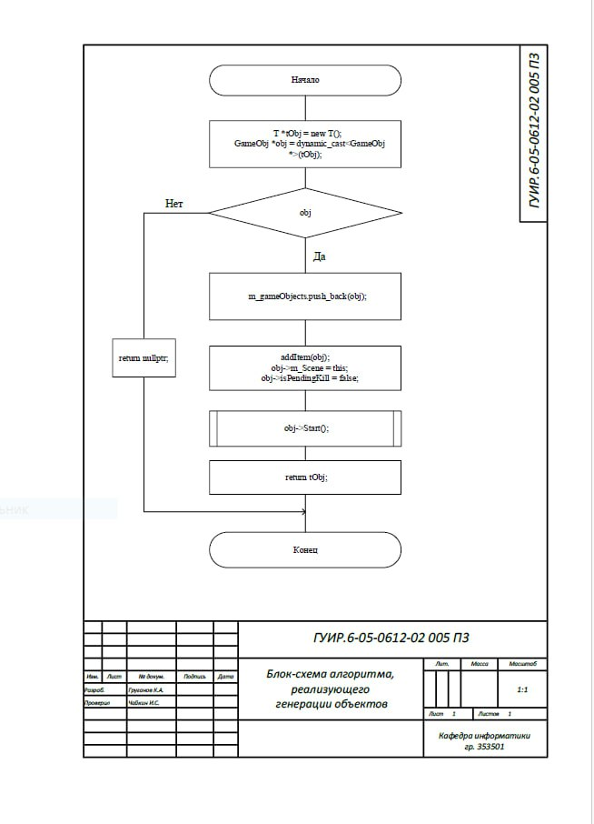
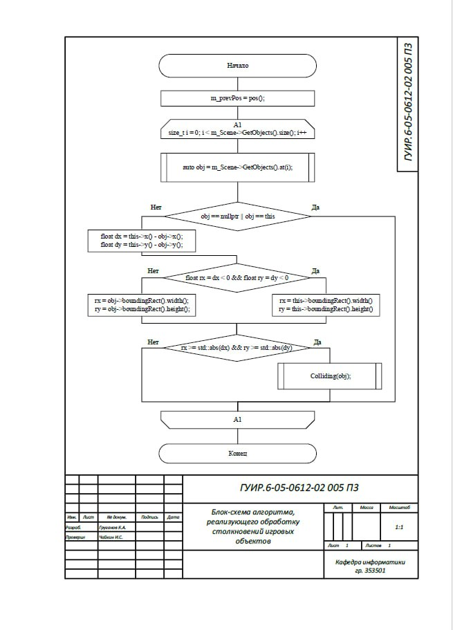
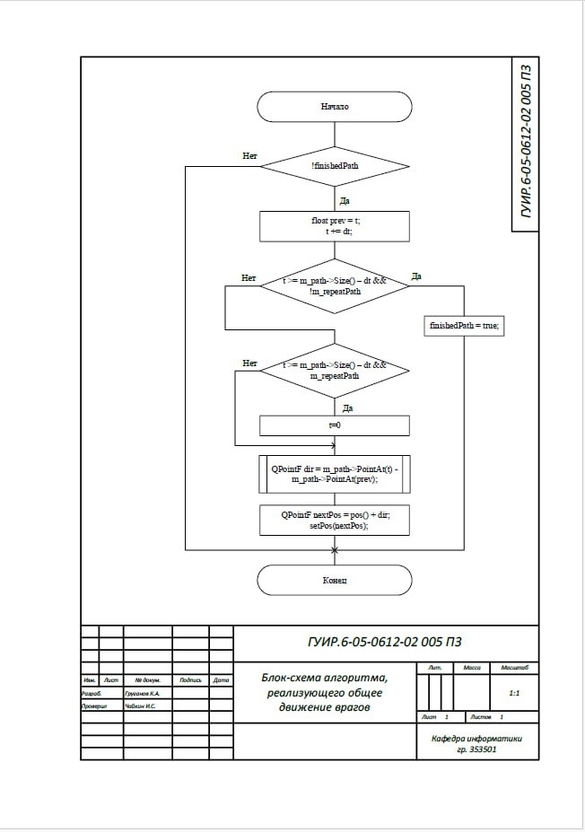
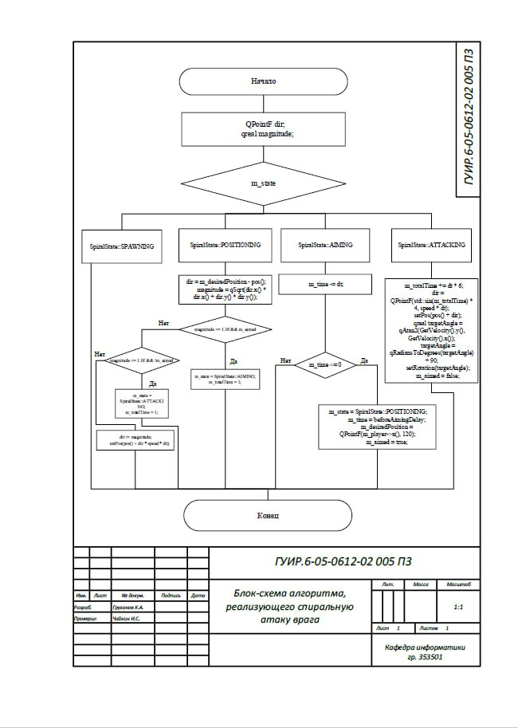
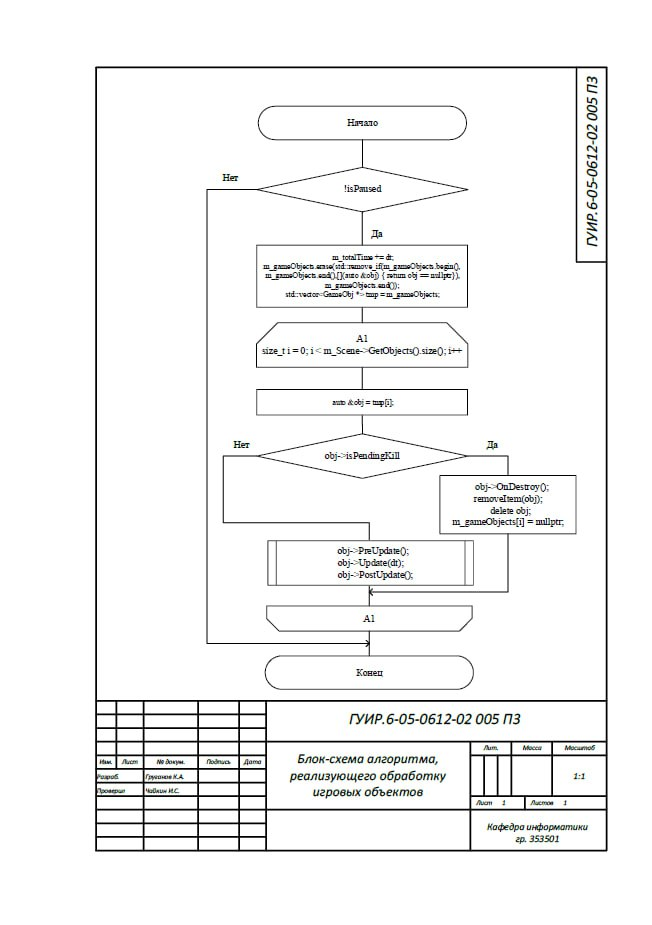
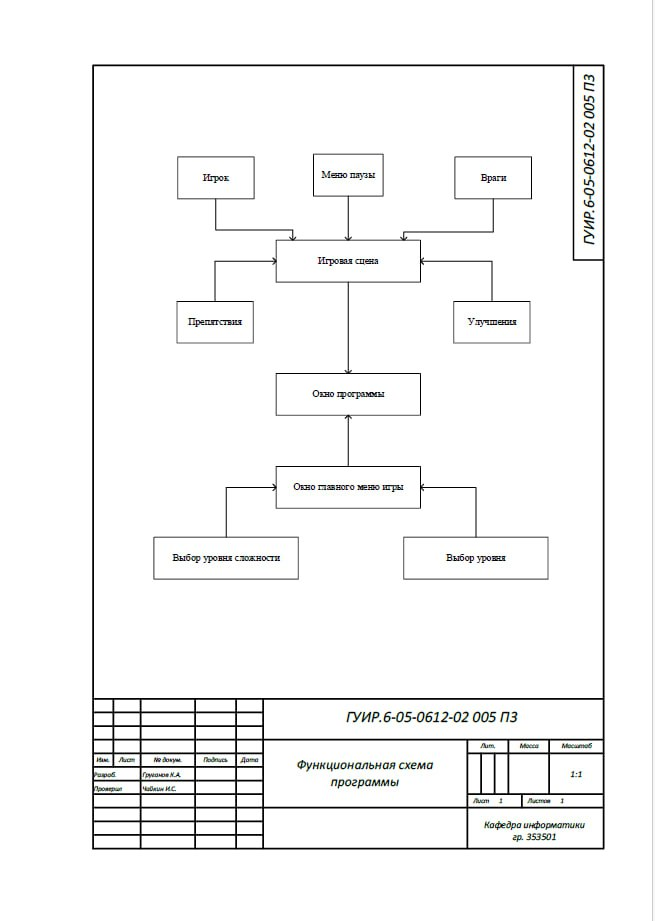

## Разработка игры аналога GALAGA

# Блок-схема алгоритма, реализующего генерации объектов

Применяется в: `gamescene.h` в функции T *GameScene::SpawnObject()

# Блок-схема алгоритма, реализующего обработку столкновений игровых объектов

Применяется в: `gameobj.cpp`  в функции void GameObj::PreUpdate()

# Блок-схема алгоритма, реализующего общее движение врагов

Применяется в: `enemy.cpp`  в функции void Enemy::moveByPath(float dt)

# Блок-схема алгоритма, реализующего спиральную атаку врага

Применяется в: `enemyspiral.cpp`  в функции void EnemySpiral::Update(float dt)

# Блок-схема алгоритма, реализующего обработку игровых объектов

Применяется в: `gamescene.cpp`  в функции void GameScene::Update(float dt)

# Функциональная схема программы

