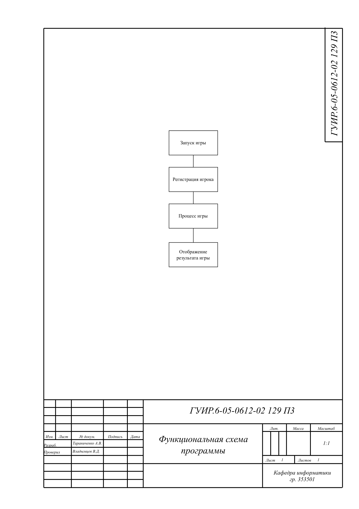
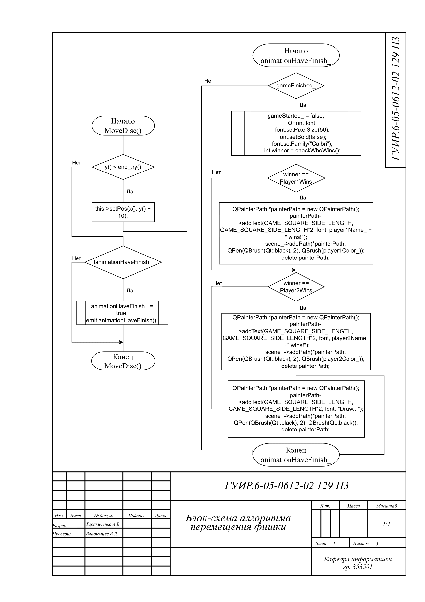
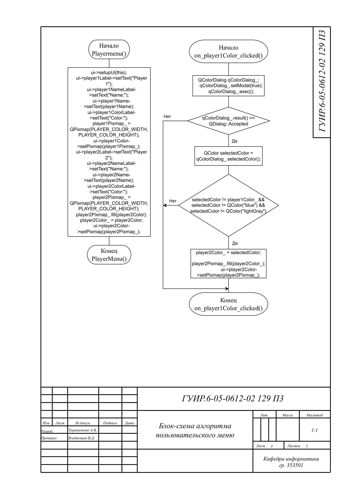
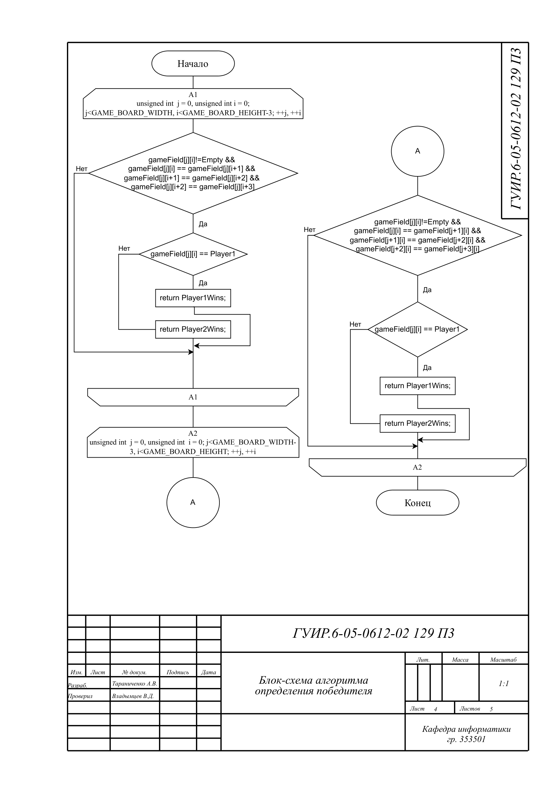
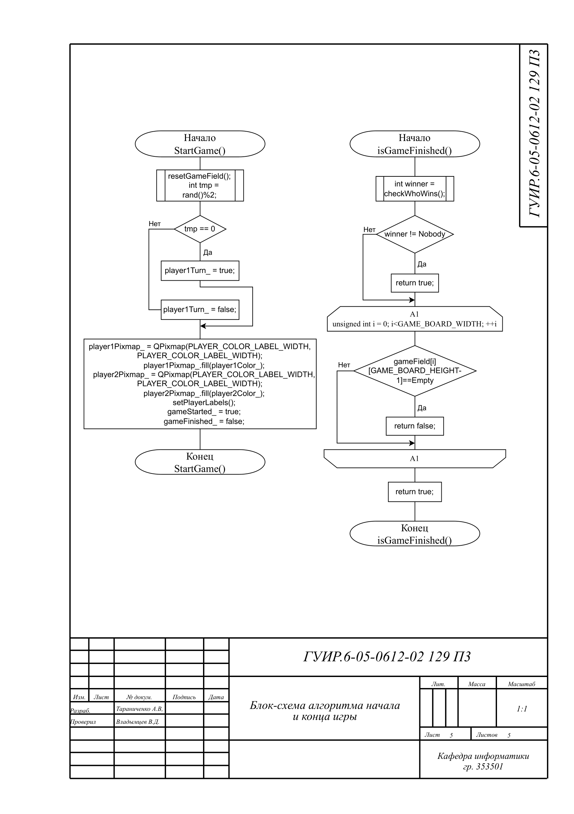

# РАЗРАБОТКА ИГРЫ 4 В РЯД

Данный проект реализует игру 4 в ряд на Qt

## Функциональная схема программы

## Блок схема алгоритма определения победителя

Применяется в: `src/MainWindow.cpp`

## Блок схема алгоритма начало и конца игры

Применяется в: `src/MainWindow.cpp`

## Блок схема алгоритма отображения игрового поля
Применяется в: `src/MainWindow.cpp`

## Блок схема алгоритма перемещения фишки

Применяется в: `src/MainWindow.cpp`

## Блок схема алгоритма пользовательского меню

Применяется в: `src/MainWindow.cpp`

